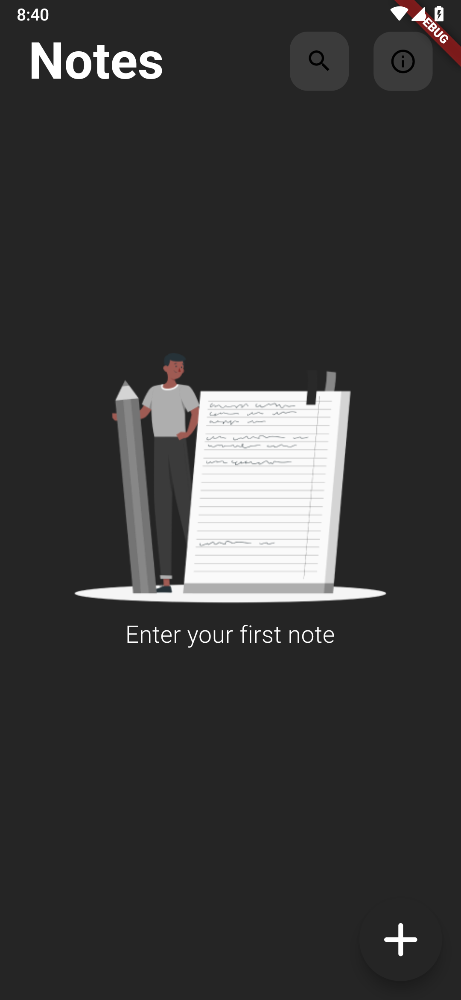
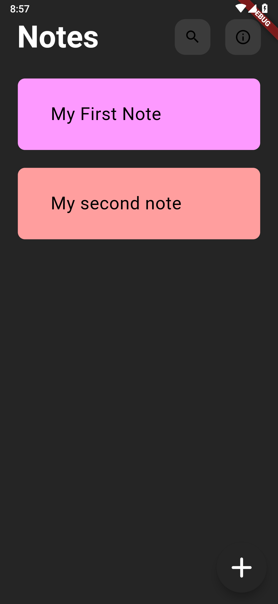
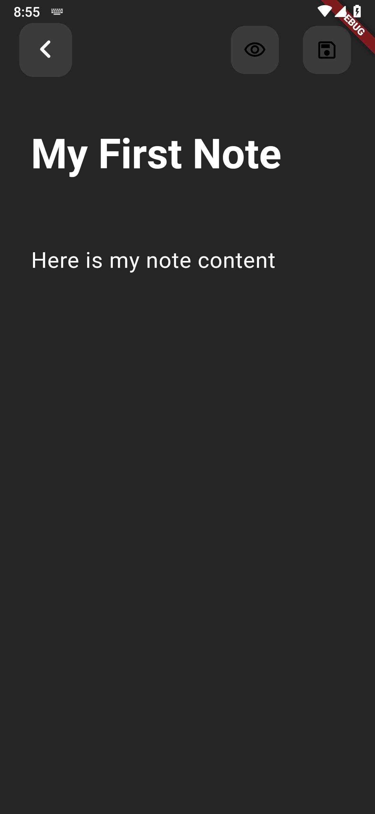
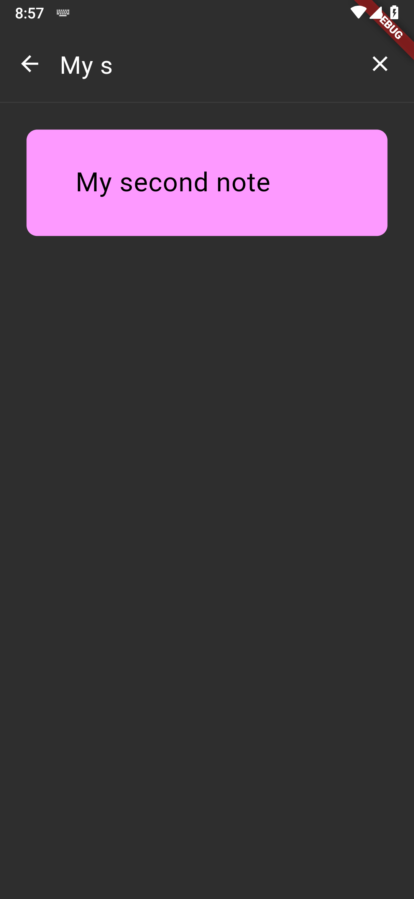

# Flutter Note-Taking App Challenge

## Screenshots

<table>
  <tr>
    <td align="center">
      
    </td>
    <td align="center">
      
    </td>
    <td align="center">
      
    </td>
    <td align="center">
      
    </td>
  </tr>
  
</table>

**Timeline:**

* **Challenge Announcement:** November 18, 2023

* **Submission Deadline:** November 27, 2023

* **Evaluation and Feedback:** November 28-29, 2023

* **Winners Announcement:** null